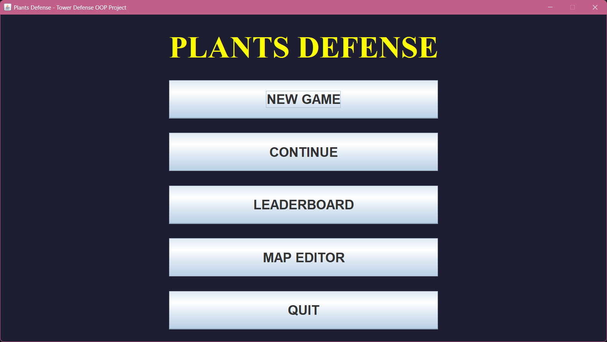
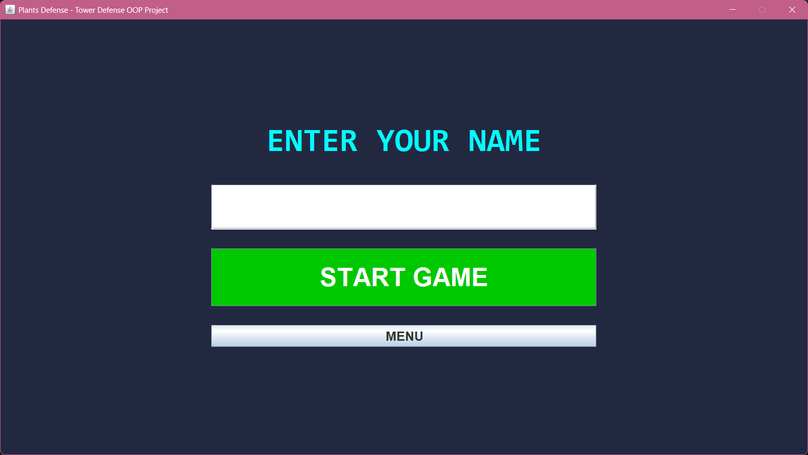
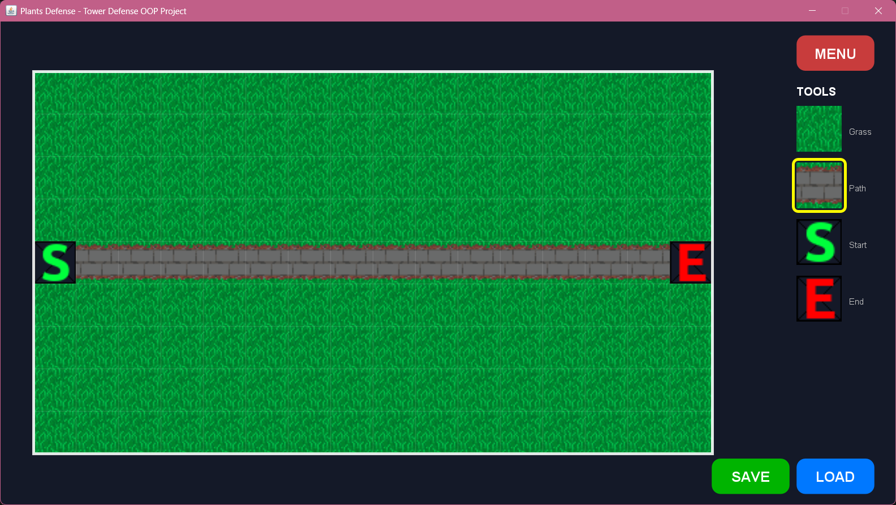
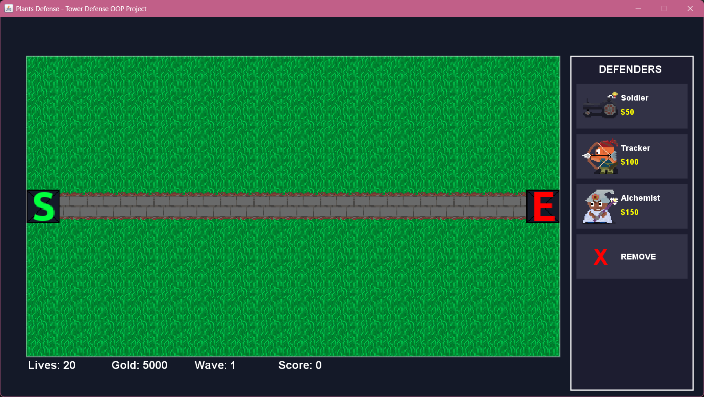
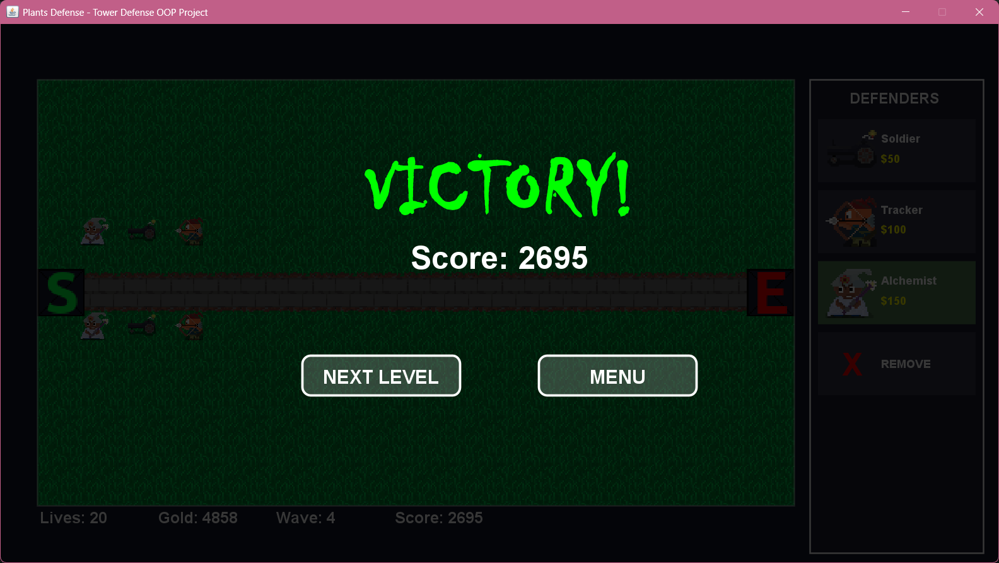
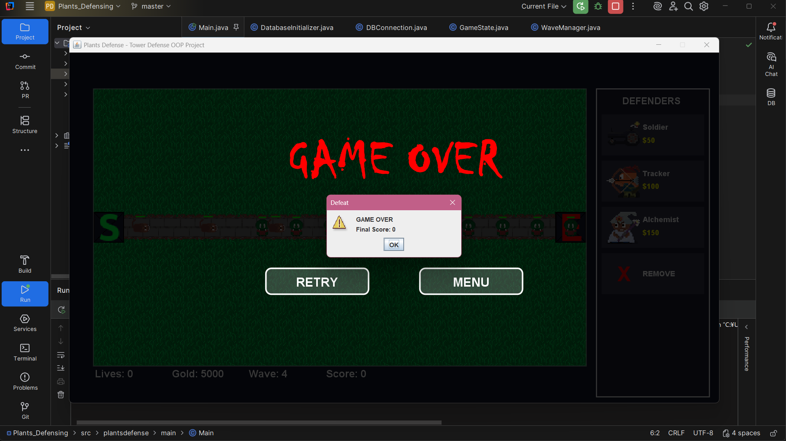

# Plants Defense — Project Report

## Intro

- What it is: Plants Defense is a small Java desktop tower‑defense game where players place plants to stop waves of enemies from reaching a goal.
- Why it exists: The project is intended as a learning/example codebase for game loops, simple pathfinding, sprite handling, level design, and lightweight persistence.

## Reference

- Inspired by: [KaarinGaming/TowerDefenceTutorial](https://github.com/KaarinGaming/TowerDefenceTutorial)

## Requirements

- Java: Java 8 (required). Ensure `javac` and `java` (Java 8) are available on your `PATH`.
- IDE (optional): IntelliJ IDEA or Eclipse for easy editing and running.
- Libraries: This project can include external jars placed in `lib/`. If you add third-party jars, include them on the classpath when compiling/running. If you have specific jars, list them in this README or in `lib/`.

## Structure

- `src/` — Java source code (package `plantsdefense`).
- `res/levels/` — Plain-text level files (map/level data).
- `lib/` — Third-party jars (if any).

Key files:

- `src/plantsdefense/main/Main.java` — Application entry point.
- `src/plantsdefense/gui/GameFrame.java` — Main window and UI wiring.
- `src/plantsdefense/gamelogic/` — Core game loop and session logic (`GameSession`, `GameState`).
- `src/plantsdefense/jdbc/` — Database helpers (connection, high scores, saves, maps).
- `src/plantsdefense/model/` — Game entities: plants, enemies, projectiles, tiles.

## UIs

The UI is Swing-based (window and panels). Main UI pieces:

- `GameFrame` — Creates the main application window.
- `ScreenController` — Manages which screen/panel is visible.
- `gui/editor` and `gui/menu` — contain editor panels and menu screens (e.g., `PlayPanel`, `LoadSavePanel`, `LeaderboardPanel`).

Panels are used to separate concerns (menu, editor, gameplay) and can be added or extended to introduce new screens.

## Gameplay

Game flow:

- `GameSession` and `GameState` manage the active session and the state of objects in the world.
- `LevelManager` loads level files from `res/levels/` and interprets map data.
- `WaveManager` spawns enemies according to configured waves.

Entities:

- Plants: located under `model/plants` (examples: `SoldierPlant`, `AlchemistPlant`, `TrackerPlant`).
- Enemies: under `model/enemies` (examples: `Zombie`, `Skeleton`, `Bat`, `Dog`).
- Projectiles: in `model/plants/shoot`.

Movement & logic:

- `Pathfinder` (in `util`) handles pathfinding for enemies.
- Sprite loading and animation use `Sprite` / `SpriteLoader` utilities.

## Persistence (database)

- `src/plantsdefense/jdbc/` contains helpers:
	- `DBConnection` — database connection details (edit to point to your DB).
	- `DatabaseInitializer` — creates tables.
	- `HighScoreDB`, `SaveDB`, `MapDB`, `PlayerDB` — basic CRUD helpers.

This project uses MySQL by default. To configure MySQL:

- Add the MySQL JDBC driver (for example `mysql-connector-java.jar`) into `lib/` and include it on the classpath.
- Edit `src/plantsdefense/jdbc/DBConnection.java` and set the connection URL, username, and password. Example:

```java
String url = "jdbc:mysql://localhost:3306/plants_defense_db?useSSL=false&serverTimezone=UTC";
String user = "your_db_user";
String pass = "your_db_password";
```

- Run `DatabaseInitializer` or start the application to auto-create tables if supported.

If you prefer a file-based DB (SQLite/H2) swap the driver and connection string and add the driver jar to `lib/`.

## Conclusion

- Getting started: open the project in an IDE and run `src/plantsdefense/main/Main.java`, or compile and run from PowerShell. Example (PowerShell):

```powershell
javac -d out -sourcepath src -cp "lib/*" src\plantsdefense\main\Main.java
java -cp "out;lib/*" plantsdefense.main.Main
```

- Contributions: add levels in `res/levels/`, new plants/enemies in `model`, or improve UI panels under `gui`.

---
File updated: reformatted README into a report-style document.

## Screenshots & Gameplay

All example screenshots and short animated clips are available in the repository under the `ref` folder:

- Static screenshots: `ref/pic/`
- Animated clips / short GIFs: `ref/vid/`


Gallery (inline previews)

### Screenshots


_Main menu_


_New player / registration_


_Map editor_


_In-game view_


_Win screen_


_Lose screen_

### Animated demos (GIFs)


_Alchemist plant effect_


_Soldier plant effect_


_Tracker plant effect_


_Placing a defender_


_Removing / selling_


_Short gameplay highlight_


_Editor interaction_


_Victory animation_


_Game over animation_


_New game / intro_


_Next level transition_


_Loading success_


_Loading fail_


_Leaderboard animation_
